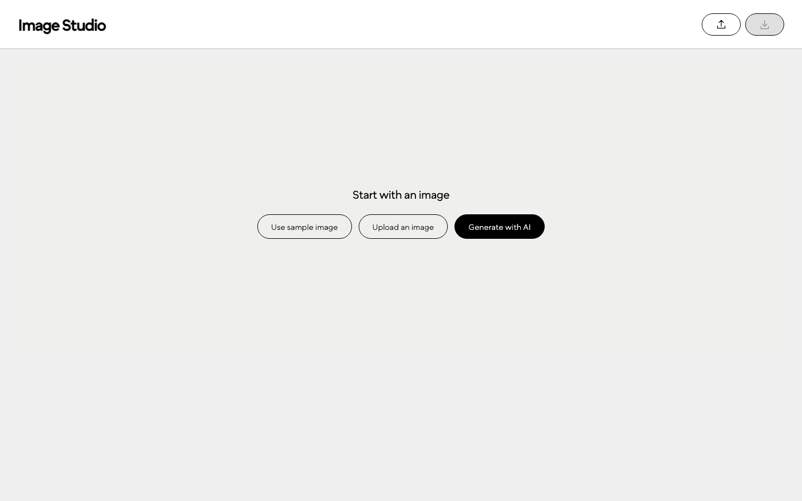

# Image Studio

**[Open the live demo](https://ai-image-editor-silk.vercel.app/)** — No sign-in required.

An image editor built with Angular, Angular Material, and TUI Image Editor **3.15.0**. Start with a sample or your own image, edit it by hand, or ask Azure **GPT Image 2** to make a change.

**Demo status:** live on Vercel. [View the source code](https://github.com/justfordev123/ai-image-editor).



## Run locally

You'll need Node.js 22.12+ and npm.

```sh
git clone https://github.com/justfordev123/ai-image-editor.git
cd ai-image-editor
npm ci
cp .env.example .env
# Add your Azure settings to .env if you want to use AI.
npm start
```

Open [localhost:4200](http://127.0.0.1:4200). This starts the app and its API. You can use the sample, upload, editing tools, and export without an API key.

## Configure AI — Azure GPT Image 2

1. Create a `gpt-image-2` deployment in Azure and get its API key.
2. Fill in `.env` with your own resource URL, deployment name, and key:

```dotenv
AZURE_OPENAI_ENDPOINT=https://your-resource.services.ai.azure.com/openai/v1/images/generations
AZURE_OPENAI_DEPLOYMENT=gpt-image-2
AZURE_OPENAI_API_KEY=
```

3. Restart `npm start` after changing these settings.

Choose **Generate with AI** to create an image. Once an image is open, use **AI → Edit image** to change it. AI receives the current canvas, including your manual edits. Your API key stays on the server.

## Features

- Start with the sample, upload a PNG/JPEG/WebP, or generate an image.
- Crop, rotate, flip, draw, adjust colors, undo/redo, and export as PNG.
- Create or edit with one prompt and one button.
- Keep saved images and favorites in this browser. Deleting the active image opens the next one or returns to the start screen.
- Use the same editor on desktop and mobile, with collapsible tools and panels.
- See progress and readable errors. Failed AI requests keep your prompt and canvas so you can try again.

## Architecture and decisions

```text
ImageEditorComponent
  ├── CanvasStartComponent → sample / upload / AI creation
  ├── ToolbarComponent → TUI canvas commands
  ├── AiPanelComponent → EditorStore (RxJS)
  ├── PropertiesPanelComponent → canvas adjustments
  └── History/favorites → EditorStore → IndexedDB

EditorStore → AiService → POST /api/generate → Azure GPT Image 2
```

- **Simple state:** one RxJS store tracks prompts, images, loading, and errors.
- **Local history:** IndexedDB saves uploads, AI results, and favorites. Refresh restores the selected image. Export manual edits before refreshing; those edits aren't autosaved.
- **Brand fit:** custom Angular controls give TUI the Creaition colors, shapes, and responsive layout.
- **Browser bundles:** TUI's browser build keeps its old Node-only dependencies out of the app bundle.
- **Real progress:** the server sends status messages while Azure works, without made-up percentages.
- **Careful retries:** rate-limit errors retry up to twice. Other failures need a manual retry to avoid duplicate charges. Server requests time out after 120 seconds; the browser stops waiting after 150 seconds.

## Fonts

The app uses the supplied `strokeWeight(var)` font, with `Eina03-Regular` as fallback. Text uses weights 60/80/120. Buttons keep the same font on hover and change only the slant from 0 to 12. [Font details](public/fonts/README.md).

## Validation

```sh
npm run check       # Formatting, TypeScript, unit/server tests, and build
npm run test:e2e    # Browser workflows with mocked AI responses
```

If Chromium is missing, run `npx playwright install chromium` first.

The latest checks passed **27 unit/server tests and 18 browser tests**, covering editing, errors, history, and mobile layouts. Real Azure creation and editing were also verified on the deployed demo; the latest creation took 36 seconds.

See the [assessment](docs/success-indicators.md), [requirement checklist](docs/requirements.md), and [deployment evidence](docs/vercel-deployment.json) for details.

### Dependency limitation

The required TUI/Fabric stack still has **10 audit findings: 6 moderate, 2 high, and 2 critical**. The app doesn't offer SVG import/export or use Fabric's Node rendering, but those limits don't fix the dependencies. Upgrading or replacing the editor needs a separate review before production use.

## Vercel demo deployment

The [live demo](https://ai-image-editor-silk.vercel.app/) runs on Vercel with Node.js 22. Set the three Azure variables from `.env` in your Vercel project. Local environment files are excluded from uploads.

To deploy from a linked checkout:

```sh
npm run check
npx vercel deploy --prod
```

The production demo is public. Preview and generated deployment URLs stay protected by Vercel. AI requests use the configured Azure resource.

## Screenshots

[Start screen](docs/screenshots/empty-canvas.png) · [Desktop editor](docs/screenshots/desktop.png) · [Mobile editor](docs/screenshots/mobile.png) · [AI result](docs/screenshots/assessment-live-create.png) · [History](docs/screenshots/upload-history.png)

## References

- [TUI Image Editor and API](https://github.com/nhn/tui.image-editor)
- [Azure image generation guide](https://learn.microsoft.com/en-us/azure/foundry/openai/how-to/dall-e)
- [Azure image API reference](https://learn.microsoft.com/en-us/azure/foundry/openai/reference-preview-latest)
- [Angular version compatibility](https://angular.dev/reference/versions)
